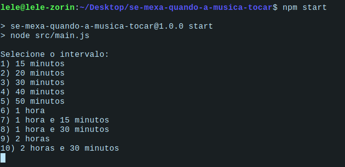

# se-mexa-quando-a-musica-tocar

## O que é este projeto?
Este projeto feito em node js é uma maneira de você se lembrar de se movimentar, mesmo que minimamente, em intervalos regulares durante o dia. No intervalo especificado, uma música tocará e você deve se movimentar enquanto a música estiver tocando. Uma notificação também é enviada para o usuário quando este deve se mexer.

## Como utilizar este projeto?
Para utilizar este projeto você precisa ter o node instalado no computador. Com o node instalado, você deve abrir a pasta raiz do projeto e rodar o comando `npm i` para baixar as dependências da aplicação, e verificar se você tem o um player de audio compatível com a dependência **play-sound** instalado, já que isto é necessário para que a música toque. Você pode ter mais informações sobre como instalar os player compatíveis [clicando aqui](https://thisdavej.com/node-js-playing-sounds-to-provide-notifications/).

Depois de baixar um player compatível você pode testar se o audio está funcionando corretamente através do comando `npm test` que executará o som padrão de teste disponível na pasta media. Após ter certeza de que a execução da música está acontecendo corretamente, você pode rodar o programa através do comando `npm start`, digitado na pasta raiz da aplicação. Uma vez inicada a aplicação, você deve selecionar o intervalo com o qual quer que a música seja tocada, e ela será tocada nesse intervalo até o encerramento do programa através de Ctrl+C no terminal.

## Como personalizar sons / músicas para se mexer
 As músicas tocadas são obtidas a partir da pasta **media**, de modo que você pode inserir suas própias músicas e sons apenas colando o arquivo na pasta, caso contrário, pode sempre utilizar o som padrão. A escolha do som a ser tocado é sempre aleatória, então se você quer que um som específico seja reproduzido, deixe a pasta com apenas o arquivo referente a este som. 

## Dependências:
- prompt-sync : permite a leitura de inputs do usuário através do console
- play-sound : utilizada para reproduzir os sons
- fs : utilizada para fazer a leitura de quais arquivos estão presentes no diretório media
- node-notifier : utilizado para criar notificações na área de trabalho 

## Links úteis
- [Instalar player compatível com o play-sound](https://thisdavej.com/node-js-playing-sounds-to-provide-notifications/)
